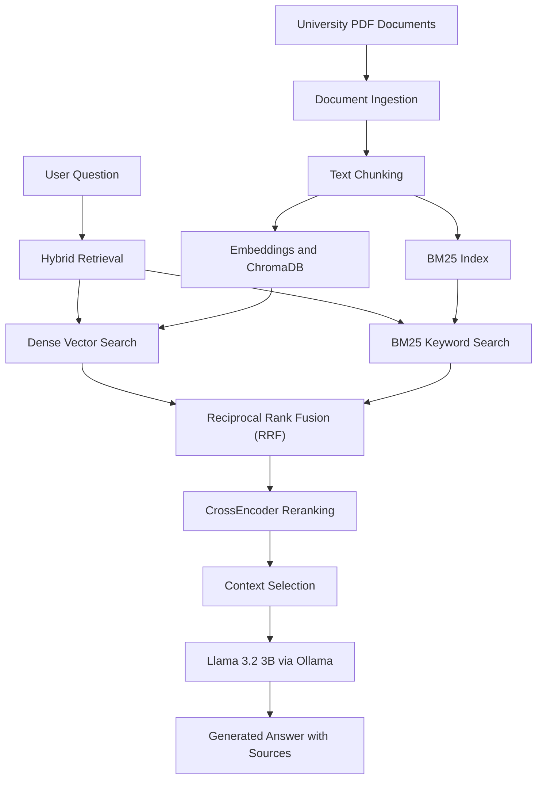

# Part B – Hybrid RAG Architecture

```mermaid
flowchart TD
    A["User Question"] --> B["Hybrid Retrieval"]

    B --> C["Dense Vector Search"]
    B --> D["BM25 Keyword Search"]

    C --> E["Reciprocal Rank Fusion (RRF)"]
    D --> E

    E --> F["CrossEncoder Reranking"]
    F --> G["Context Selection"]
    G --> H["Llama 3.2 3B via Ollama"]
    H --> I["Generated Answer with Sources"]

    J["University PDF Documents"] --> K["Document Ingestion"]
    K --> L["Text Chunking"]
    L --> M["Embeddings and ChromaDB"]
    L --> N["BM25 Index"]

    M --> C
    N --> D
```
